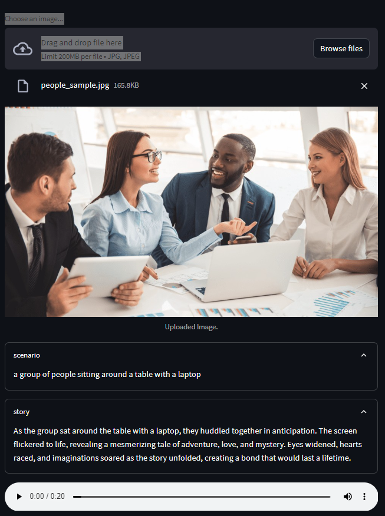

# AI application using HuggingFace and OpenAI LLM models integration using Langchain 

The objective of the app is to tell the story out of the uploaded image. 

* User uploads an image, calls an HuggingFace model ("salesforce/blip-image-captioning-base") to convert image to text.
* Using Langchain, calls an OpenAI model (GPT 3.5) with a prompt template.
* The response story is further converted to text using HuggingFace speech to text model.

* Used **Streamlit** library to provide user interface for the application

Run below command to run the pipeline:
```
 streamlit run app.py
```

